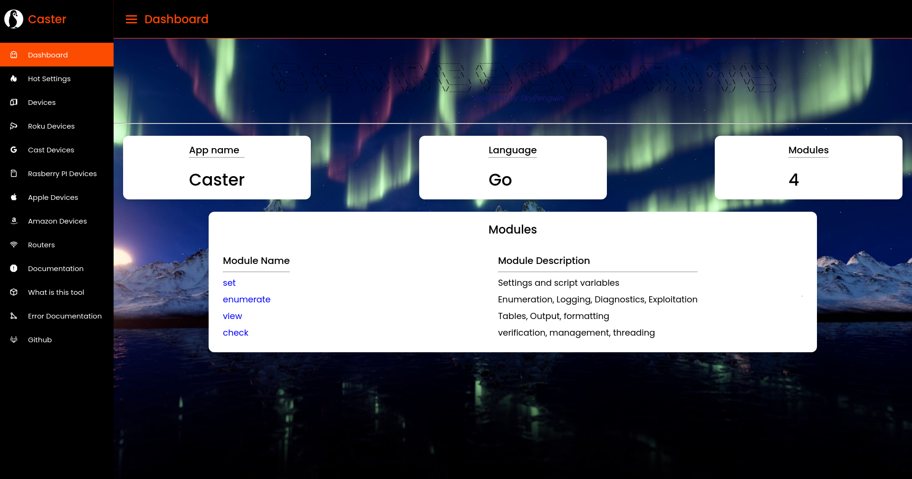

  

# What is caster 

Caster is a IoT enumeration framework designed to abuse system API's and other forms of endpoints by constantly enumerating and searching for devices on the network. Caster can do many things depending on the device you are trying to enumerate and has many features which make it worth the use like the following below.

* Server: Once you start caster a local HTTP server will be started which outputs amazing information into different categories such as routers, devices and even gives you a good documentation in case you need help. ( Server is threaded seperately and can run offline )
* Port scanner: Because of issues that may occure with the ARP module figuring out how to categorize devices, caster has a built in port scanner which can categorize devices based on open static ports and ID's. This is something you can also use!
* ARP module: This module is the best part of caster as it allows you to discover devices on the network that can be categorized, either way by default this module runs in the background on a thread, it is recommended to keep this running if you want caster to run with full support
* Enumeration options: Caster comes with so much options and modules which one of the modules allows you to target every device caster has found at once. For example if caster has found 11 roku TV's on the same network and has verified their endpoint, you can use `enumerate* roku-reboot` which will start a thread for every host ( in this case 11 ) and attack all of the roku boxes at the same time. All roku boxes will most likely be rebooted.  

# Support 

Caster has support for many devices, some devices may be able to be controlled more than others such as roku's however there is still info and enumerating support for other devices. A list below provides this detail

| Device Name | Manufac | Function and Proc | 
| ----------- | ------- | ----------------- |
| FireTV      | Amazon  |  Device info      |
| Google Cast | Google  | Sys functions, System information, ID information, Kill functions etc |
| Cast Dongel | Google  | Sys functions, System information, ID information, Kill functions etc |
| Cast 4K     | Google  | Sys functions, System information, ID information, Kill functions etc |
| Roku mini   | Roku    | Sys functions, System information, ID information, Kill functions etc |
| Roku box    | Roku    | Sys functions, System information, ID information, Kill functions etc |
| AT&T STD Router | AT&T |  Device information |
| Apple TV    | Apple   |  Downloading informational files in apples binary format |
| CMS Samsung TV's | Samsung | Exploiting LFI, Exploiting system calls, device info |
| Rasberry PI's | Raspberry Pi Foundation | Scanning for SSh and other port forms |

# Install and Run 

* `sudo apt-get install libpcap-dev`
* `sudo apt-get install golang`
* `sudo go build -o caster main.go`
* `sudo ./caster --shelp` or `sudo ./caster --help`

or via make 

* make go (removes all source code files and compiles main.go to caster)
* make install (just builds the program, leaves all source code)

